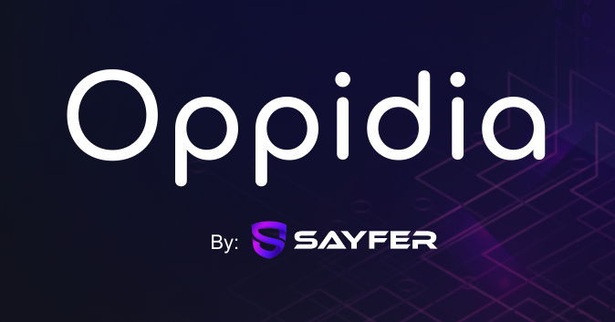

## Oppidia



Oppidia is a next-gen program protection firewall tool kit built on Solana, providing an added layer of security and
abstraction.
Our mission is to provide a secure and easy-to-use collection of programs and libraries for developers to protect their
programs and users from malicious attacks while reducing development time.

### 🌟 Features

- **Delayed Transaction Execution**: Adds a delay to critical functions, providing a safety window for transaction
  reviews.
- **Cancellation Capability**: Grants the ability to cancel scheduled transactions using trusted wallets.
- **Enhanced Security**: Minimize the risk of unwanted or malicious transactions by adding a protective time barrier.

### 🔧 Installation

TODO

### 📝 Usage

TODO - example on how to run the client code

### 🗺️ Roadmap
<small>*Not in particular order</small>
- 
- [ ] Transform into a standalone lib where developers can import the logic into their own programs
- [ ] Adding more modules other than time locking
- [ ] Create a module collections with customization for edge cases
- [ ] Create a contribution guide on how developers can join the effort
- [ ] Implement tests and CI/CD workflows
- [ ] Create a website for the project
- [ ] Create a documentation website with examples and tutorials
- [ ] Create a CLI tool for easy integration with existing programs

### 📣 Contributing

We appreciate and welcome contributions from the community! 
Please read [`CONTRIBUTING.md`](CONTRIBUTING.md) for details on how to contribute to this project.

### 🌐 License

This project is licensed under GPL-3.0. See the [`LICENSE`](LICENSE) file for details.

### 📬 Contact Us

```
Email: info@sayfer.io
Twitter: @SayferSecurity
```
